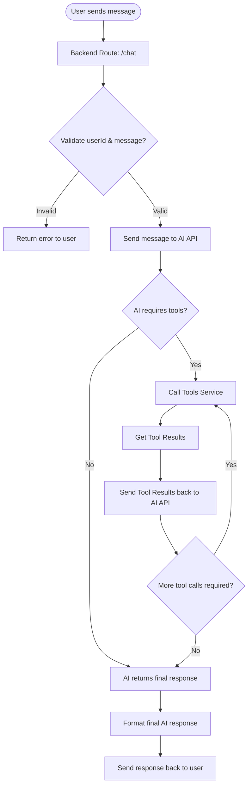

# Welcome to Finance Assistance Tracker AI 👋

[](https://github.com/RohitGadhave/finance-assistance-tracker-ai#readme)
[](https://github.com/RohitGadhave/finance-assistance-tracker-ai/graphs/commit-activity)
[](https://github.com/RohitGadhave/finance-assistance-tracker-ai/blob/master/LICENSE)

This project leverages AI modules to assist with finance-related tracking tasks. It enables users to add expense data, retrieve detailed expense reports, and perform various financial management functions with the help of intelligent automation.

### 🏠 [Homepage](https://github.com/RohitGadhave/finance-assistance-tracker-ai#readme)

## 📑 Table of Contents
- [Demo ✨](#online-demo)
- [Features 🚀](#features-🚀)
- [Getting Started 🛠️](#getting-started-🛠️)
- [API Endpoints 📡](#api-endpoints-📡)
- [Frontend 💻](#frontend-💻)
- [Environment Variables ⚙️](#environment-variables-⚙️)
- [Author 👤](#author-👤)
- [Contributing 🤝](#contributing-🤝)
- [License 📝](#license-📝)


## Online Demo

Try the live demo: ✨ [Demo](https://finance-assistance-ai-tool-rohit.netlify.app/)


## Chat Flow



## Features 🚀

- Track income and expenses
- Analyze budgets and spending habits
- Organize financial records
- Plan smarter for the future
- AI-powered chat assistant ("Finance Baba")
- RESTful API for transactions, users, chat, and topics
- Compatible with Netlify serverless deployment

## Getting Started 🛠️

### Prerequisites

- Node.js (v18+)
- MongoDB (local or Atlas cluster)
- Netlify CLI (for local serverless deployment)

### Installation

```sh
npm install
```

### Development

```sh
npm run dev
```

### Build

```sh
npm run build
```

### Start

```sh
npm start
```

### Netlify Local Development

```sh
npm run serve
```
or
```sh
netlify dev
```

### Local URL

By default, the app runs at:  
[http://localhost:4000](http://localhost:4000)

## GROQ API & Model Setup

1. Go to [groq.com](https://groq.com/) and sign up or log in.
2. Navigate to the API section and generate your API key.
3. Copy your API key and set it in your `.env` file as `GROQ_AI_API_KEY`.
4. Choose your preferred AI model (e.g., `llama-3-70b-8192` or `llama-3.3-70b-versatile`) and set it in `.env` as `AI_MODEL`.

Example `.env`:
```
GROQ_AI_API_KEY=your_groq_api_key
AI_MODEL=llama-3.3-70b-versatile
```

## Linting

- Run lint checks:
  ```sh
  npm run lint
  ```
- Auto-fix lint issues:
  ```sh
  npm run lint:fix
  ```
- Lint is enforced on staged `.ts` files via `lint-staged` and `husky`.

## API Endpoints

All endpoints are prefixed with `/api`.

### Monitor

- `GET /api/monitor/ping`  
  Health check endpoint.

### User

- `POST /api/user`  
  Create a new user.  
  **Body:** `{ "email": "you@domain.com" }`

- `GET /api/user`  
  Get all users.

- `GET /api/user/:id`  
  Get user by ID.

- `PUT /api/user/:id`  
  Update user by ID.

- `DELETE /api/user/:id`  
  Delete user by ID.

### Transactions

- `POST /api/transactions`  
  Create a new transaction.  
  **Body:**  
  ```json
  {
    "userId": "USER_ID",
    "type": "income" | "expense",
    "amount": 100,
    "source": "salary",
    "date": "2024-06-19"
  }
  ```

- `GET /api/transactions`  
  Get all transactions (supports filters: `userId`, `type`, `startDate`, `endDate`).

- `GET /api/transactions/:id`  
  Get transaction by ID.

- `PUT /api/transactions/:id`  
  Update transaction by ID.

- `DELETE /api/transactions/:id`  
  Delete transaction by ID.

### Chat

- `GET /api/chat`  
  Get chat messages for a user (requires `userId` in body).

- `POST /api/chat`  
  Send a message to the AI assistant.  
  **Body:**  
  ```json
  {
    "userId": "USER_ID",
    "message": "How much did I spend this month?"
  }
  ```

### Chat Topics

- `POST /api/topics`  
  Create a new chat topic.  
  **Body:** `{ "title": "Budget Planning", "userId": "USER_ID" }`

- `GET /api/topics/user`  
  Get all topics for a user (requires `userId` in body).

- `GET /api/topics/:id`  
  Get topic by ID.

- `PUT /api/topics/:id`  
  Update topic by ID.

- `DELETE /api/topics/:id`  
  Delete topic by ID.

### Error Logs

- `GET /api/error/:userId`  
  Get error logs for a user.

## Frontend 💻

- EJS templates for chat UI (`src/views/index.ejs`)
- Static assets in `src/public/www/assets/`

## Environment Variables ⚙️

See `.env` for configuration.  
Example:
```
PORT=4000
NODE_ENV=development
USE_MONGODB_CLUSTER=1
DB_NAME=ntf_AI_Finance_BABA
DB_USER=youruser
DB_PASSWORD=yourpass
DB_CLUSTER=yourcluster
GROQ_AI_API_KEY=your_groq_api_key
AI_MODEL=llama-3.3-70b-versatile
```
## Author 👤

👤 **Rohit Gadhave**

* Website: [@www.rohit-gadhave](https://rohit-gadhave.netlify.app)
* Github: [@RohitGadhave](https://github.com/RohitGadhave)
* LinkedIn: [@www.linkedin.com\/in\/rohit-gadhave-4b4424bb](https://linkedin.com/in/www.linkedin.com\/in\/rohit-gadhave-4b4424bb)

## Contributing 🤝
Contributions, issues and feature requests are welcome!

Feel free to check [issues page](https://github.com/RohitGadhave/finance-assistance-tracker-ai/issues). You can also take a look at the [contributing guide](https://github.com/RohitGadhave/finance-assistance-tracker-ai/blob/master/CONTRIBUTING.md).

## Show your support

Give a ⭐️ if this project helped you!


## License 📝

Copyright © 2025 [Rohit Gadhave](https://github.com/RohitGadhave).

This project is [Apache 2.0](https://github.com/RohitGadhave/finance-assistance-tracker-ai/blob/master/LICENSE) licensed.

For more details, see [documentation/ai.rest](documentation/ai.rest).
